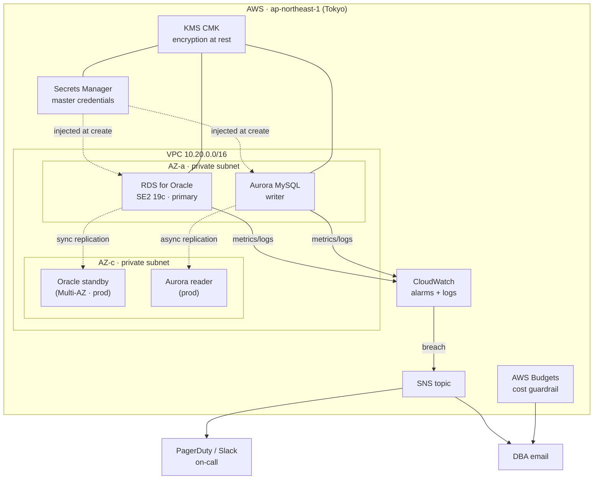

# rds-oracle-aurora-platform

A Terraform-provisioned, multi-engine database platform modelled on what a
**credit-card / fintech** company runs in production: **RDS for Oracle** +
**Aurora MySQL**, with the security, backup/DR, monitoring, and on-call plumbing
a DBA actually owns day to day.

> **Designed to cost ~$0 to evaluate.** The whole repo runs through
> `init → validate → plan` and a CI pipeline (`fmt` + `validate` + `tfsec` +
> `checkov`) **without ever creating a billable resource**. Real infra is created
> only if you explicitly `make apply`, and a one-command `make nuke` plus an AWS
> Budgets guardrail keep the bill honest. See [Cost controls](#cost-controls).

---

## Why this exists

The target role lists Oracle/MySQL DBA experience as the core, with **AWS
(RDS, Aurora), Terraform (IaC), and PCI-aware operations** as the surrounding
skills. Rather than claim those on a CV, this repo demonstrates them as working,
reviewable code. Each requirement maps to something concrete below.

### Requirement → where it lives

| JD requirement | Where it's demonstrated |
|---|---|
| **Terraform / IaC** | Whole repo: 7 composable modules under `modules/`, environment split via `environments/*.tfvars` |
| **RDS for Oracle** | `modules/rds-oracle/` — SE2 19c, License Included, encrypted, audited |
| **Aurora MySQL** | `modules/aurora-mysql/` — writer + optional reader, encrypted, slow-query logs |
| **AWS (RDS, EC2/VPC, S3, Secrets Manager, CloudWatch)** | `modules/network`, `modules/secrets`, `modules/monitoring` |
| **High availability / failover / DR** | Multi-AZ Oracle + Aurora reader (`prod` profile), automated backups + PITR |
| **Security / PCI DSS** | KMS CMK encryption at rest, secrets never in code, IAM auth, audit log exports, least-privilege SG — see [PCI DSS](#pci-dss-considerations) |
| **Monitoring + on-call (PagerDuty)** | `modules/monitoring/` — CloudWatch alarms → SNS → email / PagerDuty |
| **Cost / operational discipline** | dev/prod tfvars, AWS Budgets alarm, NAT Gateway off by default, `make nuke` |
| **Scripting (Python/Shell)** | Companion repo `dba-ops-toolkit` (health checks, slow-query reports, backup verify) |
| **Flyway / schema migrations** | Companion repo `flyway-db-migrations` |

---

## Architecture



## Module layout

```
.
├── main.tf                 # wires the modules together
├── variables.tf            # typed inputs (oracle/aurora objects, budget, alerts)
├── outputs.tf              # endpoints + secret ARNs
├── providers.tf            # AWS provider + default cost-attribution tags
├── versions.tf             # pinned provider versions; backend (commented)
├── environments/
│   ├── dev.tfvars          # single-AZ, smallest instances, $0-friendly
│   └── prod.tfvars         # Multi-AZ, reader, deletion protection
└── modules/
    ├── network/            # VPC, private subnets ×2 AZ, DB subnet group, SG
    ├── kms/                # customer-managed encryption key (rotation on)
    ├── secrets/            # generated master creds in Secrets Manager
    ├── iam/                # RDS enhanced-monitoring role
    ├── rds-oracle/         # Oracle SE2 instance + audit parameter group
    ├── aurora-mysql/       # Aurora cluster + writer/reader instances
    ├── monitoring/         # CloudWatch alarms + SNS fan-out
    └── budget/             # AWS Budgets guardrail
```

---

## How to run

### Free path (recommended — no AWS charges)

```bash
make validate            # fmt + init + validate
make plan ENV=dev        # full plan; creates nothing
make security            # tfsec + checkov static analysis
```

`terraform plan` shows exactly what *would* be built without provisioning
anything, so you can review the entire design at zero cost. The same checks run
in CI on every push (`.github/workflows/terraform-ci.yml`).

> Don't have Terraform locally? `brew install terraform tfsec checkov`
> (or use the pinned versions in the CI workflow). Everything here is validated
> in GitHub Actions regardless.

### Apply path (creates real, billable infra)

```bash
make apply ENV=dev       # builds the dev stack — see cost note below
# ... capture screenshots / test failover ...
make nuke  ENV=dev       # tears it all down
```

---

## Cost controls

Running a real RDS for **Oracle** instance is the expensive part of this stack —
Oracle has **no free tier**, and the smallest instance that runs 19c
(`db.t3.small`, License Included) bills by the hour. This repo is built so you
almost never pay for it:

1. **Plan-only by default.** The skill being demonstrated is *writing the
   Terraform*, not keeping a database running. `init/validate/plan` are free.
2. **NAT Gateway is off by default** (`enable_nat_gateway = false`). It's the
   classic silent ~$33/month idle charge; databases sit in private subnets with
   no egress need.
3. **dev profile is single-AZ** with the smallest viable instances and 1-day
   backup retention — roughly half the cost of the Multi-AZ `prod` profile.
4. **AWS Budgets guardrail** (`modules/budget`) emails at 80% (forecast) and
   100% (actual) of a configurable ceiling — `$5` in dev.
5. **`make nuke`** destroys the whole environment in one command; dev has
   `deletion_protection = false` and `skip_final_snapshot = true` so teardown
   never gets stuck.
6. **If you need real screenshots**, apply the dev stack single-AZ, capture
   CloudWatch graphs, and `make nuke` within the hour — total cost is well under
   $1. (Confirm current Oracle LI pricing in the AWS Pricing Calculator first;
   it moves.)

This is deliberately the same cost posture a production team wants from a DBA:
**provision the minimum, alarm on spend, and tear down what you don't need.**

---

## PCI DSS considerations

A credit-card platform is in PCI DSS scope. The relevant guardrails are baked in
as defaults rather than bolted on:

| PCI DSS area | Control in this repo |
|---|---|
| **Req. 3 — protect stored data** | Storage encrypted with a **customer-managed KMS key** (rotation enabled) on both engines; Performance Insights data encrypted too |
| **Req. 7/8 — access control** | `iam_database_authentication_enabled = true`; master credentials generated by Terraform and stored **only in Secrets Manager**, never in `.tf`/`.tfvars`/state-as-plaintext |
| **Req. 10 — logging & monitoring** | Oracle `audit_trail = DB,EXTENDED`; audit/alert/listener logs and Aurora audit/slowquery logs exported to **CloudWatch**; enhanced monitoring at 60s |
| **Req. 1 — network segmentation** | Databases in **private subnets**, security group allows DB ports **from within the VPC only** (no `0.0.0.0/0`), not publicly accessible |
| **Backup / availability** | Automated backups + PITR, Multi-AZ failover (Oracle) and a cross-AZ reader (Aurora) in `prod` |

> Static analysis (`tfsec`, `checkov`) runs in CI to catch regressions against
> these controls on every change.

---

## Companion repos (same story, different surface)

- **`dba-ops-toolkit`** — Python/Shell for daily ops: health checks, slow-query
  reports, automated backup-restore verification, custom CloudWatch metrics +
  PagerDuty alerts. Runs against Oracle XE in Docker (free).
- **`flyway-db-migrations`** — versioned schema migrations for Oracle + MySQL
  with a GitHub Actions pipeline and rollback strategy.

---

## Status / disclaimer

This is a portfolio project that models production patterns; it is not affiliated
with any employer. Engine versions and instance classes are examples — confirm
against current AWS availability in your region before applying.
